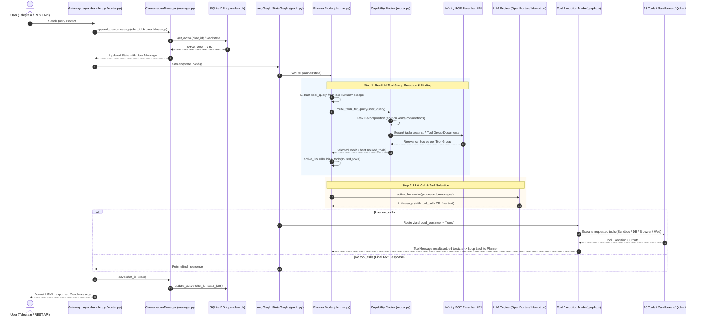

# OpenClaw (Agent-Aether) Architecture & System Design Documentation

## 1. Overview & System Vision

**OpenClaw** (internally designated **Agent-Aether**) is an enterprise-grade, autonomous AI agent platform. It combines state-of-the-art LLM reasoning with a **secure Docker container sandbox**, **two-tier dynamic capability tool routing**, **hybrid relational/vector long-term memory**, and multi-channel communication gateways (Telegram & REST APIs).

Key Design Pillars:
- **Token Efficiency via Dynamic Routing**: Exposes only relevant tool signatures per user intent using BGE Reranker task decomposition (reduces prompt tokens by up to 100% for chit-chat).
- **Isolated Sandbox Execution**: Runs untrusted code, shell commands, and background servers safely inside isolated per-session Docker containers.
- **Hybrid Multi-Factor Memory System**: Combines vector similarity, item importance, and exponential recency decay to retrieve context across past chats, semantic facts, and episodic experiences.
- **Human-in-the-Loop (HITL) Security**: Prompts users via inline Telegram buttons before executing sensitive/dangerous web browser actions.

---

## 2. Technology Stack

| Category | Technology / Framework | Purpose / Description |
| :--- | :--- | :--- |
| **Language & Runtime** | Python 3.11+ / Asyncio | High-performance asynchronous execution engine |
| **Web Framework** | FastAPI & Uvicorn | RESTful API endpoints, lifecycle hooks, and webhook handling |
| **Agent Orchestration** | LangGraph & LangChain Core | Cyclic state-graph workflow (`StateGraph`), message history management |
| **LLM Provider** | OpenRouter API (`ChatOpenAI`) | Multi-model provider access (default model: `nvidia/nemotron-3-ultra-550b-a55b:free`) |
| **Capability Reranker** | Infinity Reranker Server (`BAAI/bge-reranker-base`) | Cross-encoder relevance scoring for dynamic tool set selection |
| **Container Sandbox** | Docker SDK (`docker-py`) | Dynamic container provisioning (`openclaw-session-<id>`), process execution, port mapping |
| **Vector Database** | Qdrant | High-dimensional vector database storing `semantic_memory` and `episodic_memory` collections |
| **Relational Database** | SQLite (`sqlite3` / `aiosqlite`) | Transactional storage for active chat sessions, state JSON, and historical conversation summaries |
| **Browser Automation** | Playwright (Headless Chrome) | End-to-end web browser manipulation, element interaction, and screenshot/file extraction |
| **Integrations & OAuth2**| Google APIs Client | Google Workspace authentication & operations (Gmail API, Google Calendar & Tasks API) |
| **Messaging Gateway** | `python-telegram-bot` | Telegram bot handler, interactive inline markup buttons, HTML parsing |
| **Public Tunnels** | PyNgrok / Ngrok API | Dynamic public URL tunneling for dev servers running in Docker containers |
| **Token Analysis** | `tiktoken` | Real-time token calculation, prompt usage metrics, and log instrumentation |

---

## 3. Verified End-to-End Query Execution Order

When a user submits a prompt, OpenClaw processes the request in the following exact chronological sequence:

```
┌────────────────────────────────────────────────────────────────────────────────────────┐
│ 1. USER PROMPT RECEIVED (Telegram Gateway / REST API)                                  │
└───────────────────────────┬────────────────────────────────────────────────────────────┘
                            │
                            ▼
┌────────────────────────────────────────────────────────────────────────────────────────┐
│ 2. CONVERSATION MANAGER (app/conversation/manager.py)                                 │
│    • Calls load(chat_id) from SQLite (openclaw.db)                                     │
│    • Appends HumanMessage to state["messages"] in memory                               │
└───────────────────────────┬────────────────────────────────────────────────────────────┘
                            │
                            ▼
┌────────────────────────────────────────────────────────────────────────────────────────┐
│ 3. LANGGRAPH WORKFLOW (app/agent/graph.py -> app/agent/planner.py)                    │
│    • Invokes planner(state) node                                                       │
└───────────────────────────┬────────────────────────────────────────────────────────────┘
                            │
                            ▼
┌────────────────────────────────────────────────────────────────────────────────────────┐
│ 4. TWO-TIER CAPABILITY ROUTER (app/agent/router.py) [INSIDE PLANNER BEFORE LLM CALL]   │
│    • Extracts user query string from last HumanMessage                                  │
│    • Performs Task Decomposition (splits multi-action prompts by action verbs/commas)  │
│    • Queries Infinity BGE Reranker API against 7 tool group document definitions        │
│    • Dynamically binds ONLY matching tool signatures: active_llm = llm.bind_tools(...) │
└───────────────────────────┬────────────────────────────────────────────────────────────┘
                            │
                            ▼
┌────────────────────────────────────────────────────────────────────────────────────────┐
│ 5. LLM INVOCATION (app/agent/planner.py)                                               │
│    • Calls active_llm.invoke(processed_messages) via OpenRouter API                   │
│    • Returns AIMessage containing tool_calls OR final text response                     │
└───────────────────────────┬────────────────────────────────────────────────────────────┘
                            │
                            ▼
┌────────────────────────────────────────────────────────────────────────────────────────┐
│ 6. CONDITIONAL EDGE (should_continue in app/agent/graph.py)                             │
│    • Has tool_calls? ───► YES: Route to Tools Execution Node (call_tool in graph.py)   │
│    │                      - Executes requested tool functions (sandbox/web/memory/etc)│
│    │                      - Appends ToolMessage results & loops back to planner        │
│    │                                                                                   │
│    └───► NO: Return final_response text string                                         │
└───────────────────────────┬────────────────────────────────────────────────────────────┘
                            │
                            ▼
┌────────────────────────────────────────────────────────────────────────────────────────┐
│ 7. STATE PERSISTENCE & RESPONSE (app/gateway/telegram/handler.py)                      │
│    • Calls conv_manager.save(chat_id, state) to store updated JSON in SQLite           │
│    • Formats and sends final response message to user                                  │
└────────────────────────────────────────────────────────────────────────────────────────┘
```

---

## 4. Sequence Diagram & Interactions



---

## 5. Core Architectural Components

### 5.1 Gateway Layer (`app/main.py`, `app/gateway/`, `app/api/`)
- **FastAPI Application Entrypoint** ([main.py](file:///d:/VS/openclaw/app/main.py)): Runs SQLite migrations, initializes Docker sandbox manager, configures Qdrant collections, and manages application startup/shutdown lifespan.
- **Telegram Gateway** ([handler.py](file:///d:/VS/openclaw/app/gateway/telegram/handler.py)): Appends incoming prompt to `ConversationManager`, starts graph execution, updates status messages in real-time, handles `/gmail`, `/calendar`, `/end` commands, and manages interactive inline callback approvals.

### 5.2 Conversation Manager (`app/conversation/manager.py`)
- **State Loading (`load`)**: Retrieves active conversation JSON state for `chat_id` from SQLite (`openclaw.db`).
- **User Message Appending (`append_user_message`)**: Appends the latest `HumanMessage` to `state["messages"]`.
- **State Persistence (`save`)**: Updates active state JSON in SQLite after graph execution finishes.
- **Archiving & Summarization (`end`)**: Summarizes session history using LLM, extracts semantic facts & episodic memories into Qdrant vector database, archives summary, and clears active state.

### 5.3 Two-Tier Capability Tool Router (`app/agent/router.py`)
Executes **inside the Planner node BEFORE the LLM call**:
1. **Tier 1: Chit-Chat Fast-Path**: Detects small-talk or conversational greetings. If detected, exposes 0 tools to the LLM (pure text mode, saving 100% of tool definition tokens).
2. **Tier 2: Task Decomposition & BGE Reranking**:
   - Splits incoming query into atomic tasks based on action verbs (`make`, `build`, `search`, `send`, `run`, `read`, etc.) and clause splitters (`and then`, `after that`, `;`, `,`).
   - Sends tasks to Infinity API (`BAAI/bge-reranker-base` model) to calculate relevance against 7 tool group documents (`memory`, `web`, `coding`, `gmail`, `calendar`, `browser`, `sandbox`).
   - Filters and returns the matched tool group functions to `bind_tools`.

### 5.4 Agent Orchestration & Tool Execution Node (`app/agent/graph.py`, `app/agent/planner.py`)
- **Planner Node**: Receives state, truncates past long tool execution outputs, prepends system prompt, routes tool signatures, calls LLM, and calculates token usage.
- **Conditional Routing (`should_continue`)**: Checks if `tool_calls` attribute exists on LLM response.
- **Tool Execution Node (`call_tool`)**: Executes selected tool functions (e.g. `execute_bash_command`, `retrieve_memory`, `web_search`), measures duration, and returns `ToolMessage` results.

### 5.5 Isolated Docker Sandbox Runtime (`app/runtime/`, `app/tools/sandbox/`)
- **Container Provisioning**: Creates isolated per-session Docker containers (`openclaw-session-<chat_id>`) mounting workspace directory `/workspace`.
- **Execution Tools**: Executes bash commands, Python blocks, and Node.js code safely.
- **Background Servers & Tunnels**: Launches background dev servers (React, Vite, FastAPI), polls host port TCP socket readiness, and exposes Ngrok public preview URLs.

### 5.6 Hybrid Memory System (`app/database/`, `app/conversation/`, `app/tools/memory.py`)
Retrieves context across 3 memory stores (SQLite summaries, Qdrant semantic facts, Qdrant episodic logs) using a multi-factor scoring formula:

$$\text{Final Score} = 0.60 \cdot S_{\text{similarity}} + 0.25 \cdot S_{\text{importance}} + 0.15 \cdot e^{-\lambda \cdot t}$$

(Recency decay uses a 30-day half-life: $\lambda = \frac{\ln(2)}{30}$).

---

## 6. Complete Tool Capabilities (28 Tools across 7 Groups)

| Tool Group | Tools Included | Primary Responsibilities |
| :--- | :--- | :--- |
| **Coding** | `read_file`, `write_file`, `manage_file`, `list_files`, `search_files` | Workspace file creation, inspection, refactoring, and directory traversal |
| **Sandbox** | `execute_bash_command`, `execute_python_code`, `execute_node_code`, `start_sandbox_server`, `stop_sandbox_server`, `get_sandbox_preview` | Secure Docker code execution, dev server management, HTTP readiness polling, Ngrok tunnels |
| **Memory** | `retrieve_memory` | Cross-source memory retrieval (SQLite chat summaries, Qdrant semantic facts & episodic logs) |
| **Web** | `web_search` | External search engine queries via Tavily API for up-to-date documentation and web facts |
| **Browser** | `browser_open`, `browser_interact`, `browser_navigate`, `browser_scroll`, `browser_file`, `browser_close` | Playwright browser navigation, form typing, element clicking, file upload/download, page screenshotting |
| **Gmail** | `gmail_search`, `gmail_read`, `gmail_send`, `gmail_reply`, `gmail_download_attachment` | Google OAuth2 Gmail integration for searching, reading, drafting, sending, and downloading email files |
| **Calendar** | `list_calendar`, `manage_event`, `manage_task`, `calendar_free_busy` | Google Calendar & Tasks management, scheduling events, managing tasks, and checking schedule availability |
